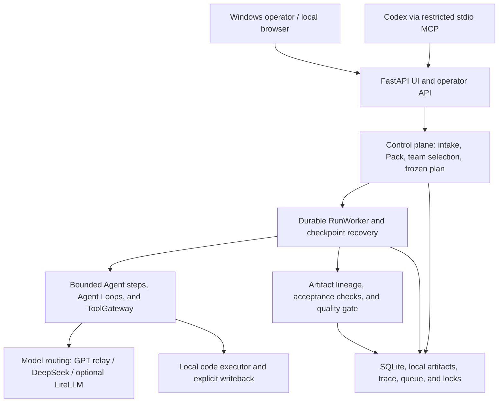
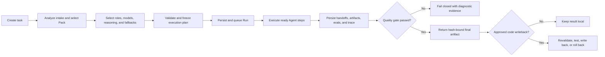

# Team Agent Harness

Local Windows control plane for durable, observable GPT + DeepSeek multi-agent
workflows. It turns a task into a frozen execution plan, runs the plan through
bounded agents and tools, persists every checkpoint, and verifies the final
artifact before optional writeback.

The runnable project lives in [`team_agent_harness/backend`](team_agent_harness/backend/README.md).
Shared design records live in [`docs/superpowers/specs`](docs/superpowers/specs/).
The current model routing contract is documented in
[`docs/model-routing.md`](docs/model-routing.md).

## Project Positioning

Team Agent Harness is an engineering-grade local multi-model workflow MVP. It
is designed for one trusted Windows operator who wants GPT and DeepSeek to work
through explicit roles, recoverable runs, auditable artifacts, and controlled
side effects.

It is more than a prompt chain: tasks, immutable plans, Agent runs, handoffs,
artifacts, eval results, traces, queue state, locks, and approvals are persisted
and linked. It is not yet a general autonomous multi-agent framework: built-in
Workflow Packs still define the collaboration boundary, most Pack positions
use one model call unless Agent Loop is enabled, and external Codex/ACP child
processes are not launched by the runtime.

## Layered Architecture



| Layer | Responsibility |
|---|---|
| Operator surface | Chinese browser UI, local API, CLI, and restricted Codex MCP tools |
| Control plane | Task intake, Workflow Packs, user-selected teams, route validation, and immutable execution plans |
| Execution | Durable local worker, dependency scheduling, bounded Agent Loops, typed tools, approvals, and recovery |
| Model control | Direct GPT relay by default, official DeepSeek direct access, ordered fallback, and optional LiteLLM advanced routing |
| Evidence | SQLite state, hash-bound artifacts, handoffs, eval results, provider receipts, and complete trace |
| Code safety | Isolated workspace, patch preview, real tests on the patched workspace, explicit writeback, journal, and rollback |

## Current Status

| Area | Current state |
|---|---|
| Product maturity | Stable local engineering MVP approaching Alpha/Beta; not a public production platform |
| Supported environment | Windows, one trusted operator, one local Uvicorn/FastAPI process |
| Persistence | SQLite is authoritative; local artifacts hold outputs and checkpoints |
| Built-in workflows | Code R&D, Institutional Code R&D, and Research |
| Default GPT route | Direct `gpt_relay/gpt-5.6-sol`; Chat Completions protocol |
| Default DeepSeek route | Official `deepseek/deepseek-v4-flash` |
| Advanced routing | Local LiteLLM remains optional and is not started in direct mode |
| Model choice | Every fixed Pack position can use an operator-selected GPT or DeepSeek role, provider, model, reasoning effort, and bounded fallback |
| Codex integration | Codex can submit a validated plan, start or observe a Run, and retrieve quality and final artifacts through restricted MCP tools |
| Recovery guarantee | Completed checkpoints resume after restart; an interrupted external request may be repeated |

Mock execution remains the compatibility path when real providers are not
configured or confirmed. Desktop startup can load the reviewed real routing
defaults, but it does not bypass per-run real-model consent.

## Capability Matrix

| Capability | Status | Enforced boundary |
|---|---|---|
| Durable background runs | Available | Queue and lock state persist in SQLite; worker health is observable |
| Restart recovery | Available | Only validated completed checkpoints are reused |
| Configurable GPT + DeepSeek teams | Available | Selection cannot widen the Pack DAG, tools, ownership, or runtime limits |
| GPT relay fallback to DeepSeek | Available | Retryable transport/upstream failures only; auth and local validation failures fail closed |
| Bounded Agent Loop | Opt-in | Step, token, time, tool, repetition, and estimated-cost budgets |
| Planner/operator DAG | Available | Plan is schema-validated, permission-bounded, then frozen for the Run |
| Parallel branches | Available where safe | Dependencies and workspace ownership must not conflict |
| Semantic quality gate | Available | Checks acceptance criteria, latest-attempt lineage, hashes, blockers, and final content |
| Local code patch and test | Available | Patch is applied and tested in the same isolated workspace |
| Source writeback | Approval-gated | Preview, hash revalidation, journal, test, and rollback are mandatory |
| Terminal-history cleanup | Available | Exact Run/Artifact snapshot, same-volume file quarantine, rollback, startup recovery, and batched SQLite deletion |
| Single-Agent vs Multi-Agent benchmark | Available | Reports quality, latency, usage, estimated cost, contradictions, and role contribution |
| Codex plan delegation | Available | The composite delegation route is DeepSeek-only with no GPT fallback |
| External Codex/ACP runtime sessions | Not implemented | Session/ACP records are control metadata, not child processes |

## Main Flow



For normal Research work, Planner, Writer, and Final Reviewer default to the
direct GPT relay, while Searcher, Reader, and Verifier default to official
DeepSeek. Retryable GPT failures may use the frozen DeepSeek fallback. In Codex
delegation mode, Codex authors the plan and every Harness position uses official
DeepSeek; Codex then polls the Run, quality report, and final artifact.

## Quick Start

No server deployment is required. After you have access to this repository:

1. On GitHub, choose **Code > Download ZIP**.
2. Extract the entire ZIP to a normal folder. Do not run files inside the ZIP preview.
3. Double-click `Start-Team-Agent-Harness.cmd` in the extracted folder.
4. The first run prepares project-local Python environments and creates
   `Team Agent Harness Launcher` on your desktop. Later runs reuse them.
5. In the launcher, enter your GPT relay key and `/v1` base URL plus your
   DeepSeek API key. Keep **direct** and **Chat Completions** as the normal
   route; a local LiteLLM key is needed only for advanced LiteLLM mode. Choose
   **Save**, then **Start Services**. The launcher opens the UI only after worker health
   and the actual HTML workspace are ready; **Open UI** remains disabled before
   that point.

The first run needs an internet connection to download Python packages. Python
3.12 or 3.13 is required for LiteLLM. If neither version is installed, setup
offers to install Python 3.13 for the current Windows user through `winget`; it
does not silently install global software. Provider credentials stay in the
ignored local file `team_agent_harness/backend/.env.local` and are never added
to the repository.

Normal local endpoints are:

- Harness: `http://127.0.0.1:8014/`
- LiteLLM (advanced mode only): `http://127.0.0.1:4000/`

If a project-local environment becomes incomplete, rebuild only those ignored
environments from PowerShell:

```powershell
.\team_agent_harness\backend\scripts\setup-desktop.ps1 -Repair
```

### Developer Setup

The desktop bootstrap handles this automatically. For a manual development
environment, run:

```powershell
Set-Location .\team_agent_harness\backend
py -3.13 -m venv .venv
.\.venv\Scripts\python.exe -m pip install -e ".[test]"
.\.venv\Scripts\python.exe -m pytest -q
.\scripts\start-harness.ps1
```

### Codex MCP Control

The backend includes `scripts/codex_harness_mcp.py`, a loopback-only stdio MCP
adapter. Registering it is an explicit Codex configuration change, so setup
does not do that automatically. From `team_agent_harness/backend`, inspect the
installed command contract with `codex mcp add --help`, then register the local
Python and adapter paths. Real-model and real-web confirmations remain disabled
unless the MCP process is separately granted
`TEAM_AGENT_CODEX_ALLOW_REAL_MODELS=1` or
`TEAM_AGENT_CODEX_ALLOW_REAL_WEB=1`. See the backend README for the exact
command and tool boundary. The composite `harness_delegate_plan` tool accepts a
Codex-authored plan, freezes it into the task inputs, validates every Pack slot
as official DeepSeek `deepseek-v4-flash`, and can optionally submit a background
run. It never adds a GPT fallback; Codex can poll the run, quality report, and
hash-bound final artifact through the existing read tools.

## Security Boundary

- The supported service binds to loopback and assumes one trusted local
  operator. Public internet exposure is not supported.
- Provider credentials stay in the ignored local
  `team_agent_harness/backend/.env.local`; keys are not stored in task payloads,
  SQLite, trace events, artifacts, or tracked routing files.
- Real model, web, browser, host-test, runtime approval, and source-write
  actions are separate gates. Enabling one does not grant another.
- Remote GPT relay URLs must use HTTPS and cannot contain credentials, query
  strings, or fragments. Plain HTTP is allowed only for local development
  addresses.
- OpenAI-compatible model transports disable HTTP redirects and environment
  proxy inheritance; an upstream cannot replay the model request body to a
  second origin.
- The Codex MCP adapter is loopback-only and does not expose approval,
  writeback, arbitrary shell, Git, configuration, dependency installation,
  deletion, deployment, or credential tools.
- Model outputs, web content, and referenced files are untrusted input.
  ToolGateway permissions, context budgets, content hashes, and approval gates
  remain authoritative.
- Hard restart recovery is at-least-once for an interrupted external call, not
  exactly-once. Provider billing may occur even when the local response is lost.

This is Ting's private personal project. The absence of a `LICENSE` file grants
no permission to copy, redistribute, or sublicense the code, while GitHub
collaborators can still be invited to the private repository. The project does
not copy or integrate the AGPL-licensed RyensX/OpenCodex remote UI, preserving
the option to choose a separate license or commercial model later.

## Verification

Latest local verification on 2026-08-22:

- Default run-scoped routing is direct `gpt_relay/gpt-5.6-sol` for Planner, Writer,
  and Final Reviewer, with official `deepseek-v4-flash` for Searcher, Reader,
  and Verifier.
- GPT routes include official DeepSeek as an ordered fallback. All real routes
  default to `reasoning_effort="xhigh"`; users can override model and reasoning
  level after capability validation.
- Direct Chat Completions smoke passed with `23` total tokens; official DeepSeek
  smoke passed, and a controlled retryable GPT failure selected real DeepSeek.
- A real Codex-authored Research plan completed 6/6 DeepSeek roles, passed the
  quality gate, and returned a 2,123-character hash-bound final artifact with no
  error trace. Port `4000` was not listening in direct mode.
- The full local backend suite passed `1360 passed, 5 skipped, 1 warning` after
  the direct-relay, recovery, routing, history-cleanup, security, polling, and Codex delegation updates. The
  warning is the existing Starlette `TestClient` deprecation notice; no test or
  runtime failure remains.
- `compileall`, JavaScript syntax, PowerShell parsing, JSON parsing, `pip check`,
  `git diff --check`, and a high-confidence credential scan passed.
- Direct mode left port `4000` unused. Desktop and 390-pixel browser checks had
  no overflow, console error, or console warning.
- A temporary 100-Run mock stress completed `100/100`, with zero failed Runs,
  active queue items, or acquired locks; SQLite reported `integrity_check=ok`
  and zero foreign-key violations. A first `tracemalloc`-instrumented probe
  exceeded its 120-second observation window; the production-path rerun
  completed in 137.198 seconds.
- For 500 frozen Runs, the polling payload fell from 4,058,001 to 74,001 bytes
  (`98.18%` smaller), while median local response time fell from 0.266 to 0.050
  seconds. The browser then proved that active polling requests only health,
  Run summaries, and the selected Run detail.

These results describe the local worktree, not the current GitHub remote. The
latest published CI evidence is commit `5643b69`: [GitHub Actions run
`31795016194`](https://github.com/Ting-fate/team-agent-harness/actions/runs/31795016194)
passed on Windows Python 3.12, 3.13, and 3.14 with
`1325 passed, 1 skipped, 1 warning` in every job.

## Not Included

- Distributed workers, high availability, or multi-process queue ownership.
- Multi-user identity, tenant isolation, public hosting, or a production remote
  browser/PWA service.
- True persistent Codex, Claude, ACP, or other external Agent child processes.
- Unlimited autonomous replanning, self-expanded permissions, or unrestricted
  tool execution.
- Exactly-once execution or exactly-once billing for interrupted provider calls.
- A persisted cross-restart cap on uncertain real-model redispatches; repeated
  hard crashes can repeat the interrupted call until the operator stops or
  reconfigures the service.
- Hard cancellation of an operating-system DNS lookup or a provider transport
  that never returns control. Web body reads are bounded, but DNS/TLS/header
  timing still depends on the underlying transport.
- A general cross-language code sandbox; the current local executor is a
  controlled MVP centered on reviewed commands and `pytest` evidence.
- A guarantee that more Agents outperform a single Agent; the benchmark surface
  measures that question instead of assuming the answer.
- AGPL remote UI code, a public open-source license, deployment automation, or
  commercial licensing terms.
